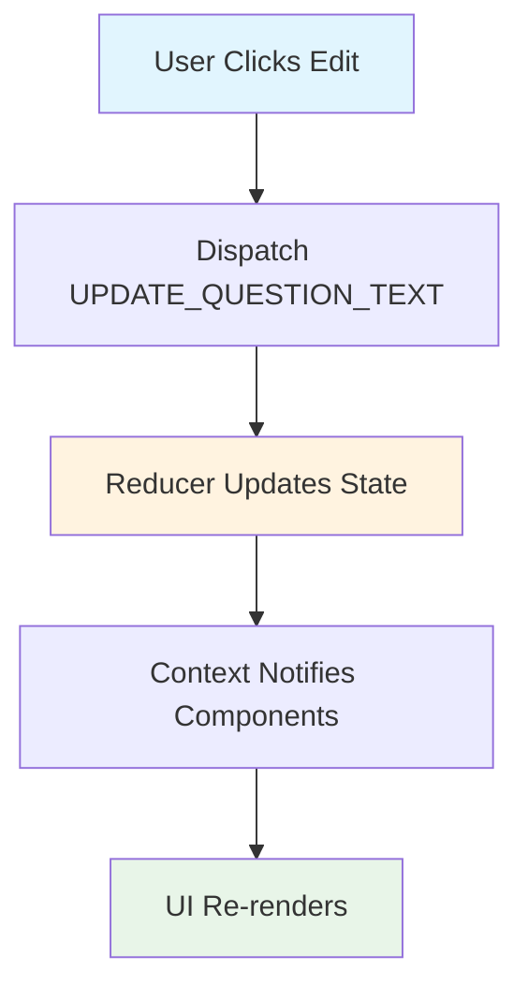
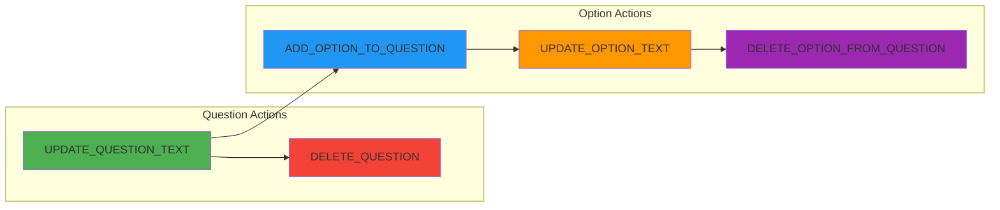

# Week-09 Advanced State, useReducer, and useContext

## Exercise Objectives

By completing this exercise, you will:

1. **Extend existing useReducer implementations** by adding new action types following established patterns
2. **Implement new features using existing Context architecture** without breaking current functionality
3. **Connect UI components to reducer actions** through Context dispatch
4. **Experience realistic client-driven feature development** by enhancing a working MVP
5. **Follow established code patterns** when adding functionality to existing applications

## Scenario Details

### The Setup

Your team successfully delivered an Survey Builder MVP to a client who loved the demo! The MVP allows users to:

- ✅ Create new survey questions (text, multiple-choice, yes/no, rating)
- ✅ Add answer options to multiple-choice questions
- ✅ Preview the survey as users would see it
- ✅ Edit survey title and description
- ✅ Toggle between edit and preview modes

The MVP was built with proper React patterns using `useContext` and `useReducer` for clean state management.

### Client Enhancement Request

_"This is exactly what we wanted! Can you add the ability to **edit questions after creating them**, **edit the answer options**, and **delete questions we don't need anymore**?"_

### Your Task

Extend the existing survey builder by implementing question and option editing features while following the established code patterns. You'll implement several new reducer actions, update SurveyContext and create a few components for working with questions in edit mode.

**Estimated Time:** 60-75 minutes total

## Instructions

### Phase 1: Explore the MVP (10 minutes)

1. **Interact with the working survey builder**
   - Create different types of questions
   - Add options to multiple-choice questions
   - Toggle to preview mode to see the survey
   - Edit the survey title

2. **Examine the code structure**
   - Look at how `SurveyContext` is implemented with the useReducer + Context pattern
   - Study the existing reducer actions in the `surveyReducer` function
   - Notice how components use `useContext` to access state **AND** dispatch
   - Explore `NewQuestion` and `QuestionDialog` components to see dialog patterns
   - Review how question type constants are organized in `surveyReducer.js`

3. **Identify implementation areas**
   - Find where you'll add Edit and Delete buttons
   - Locate where new reducer actions need to be added

### Phase 2: Implement New Reducer Actions (15 minutes)

> **Actions to implement**
>
> - `UPDATE_QUESTION_TEXT` - Update question text by ID
> - `DELETE_QUESTION` - Remove question from survey
> - `ADD_OPTION_TO_QUESTION` - Add new option to multiple-choice question
> - `UPDATE_OPTION_TEXT` - Edit existing option text
> - `DELETE_OPTION_FROM_QUESTION` - Remove option from question

#### Action 1: UPDATE_QUESTION_TEXT

Add a new case to the `surveyReducer` function:

```javascript
case 'UPDATE_QUESTION_TEXT':
  // TODO: Find the question by ID and update its text
```

**Requirements:**

- Find question by `payload.id`
- Update the question's `question` property with `payload.newText`

#### Action 2: DELETE_QUESTION

Add another case to the `surveyReducer` function:

```javascript
case 'DELETE_QUESTION':
  // TODO: Remove question from array and clear editing state
```

**Requirements:**

- Find and remove question with matching `payload.id` from questions array
- Set `ui.editingQuestionId` to `null` if deleting currently edited question

#### Action 3: ADD_OPTION_TO_QUESTION

Add a new case to handle adding options to existing multiple-choice questions:

```javascript
case 'ADD_OPTION_TO_QUESTION':
  // TODO: Add new option to specific question
  // Find question by payload.questionId
  // Add payload.optionText to that question's options array
```

**Requirements:**

- Find question by `payload.questionId`
- Add new option with `payload.optionText` to the question's `options` array
- Only works for multiple-choice questions

#### Action 4: UPDATE_OPTION_TEXT

Add a new case to handle editing existing options:

```javascript
case 'UPDATE_OPTION_TEXT':
  // TODO: Update specific option text
  // Find question by payload.questionId
  // Update option at payload.optionIndex with payload.newText
```

**Requirements:**

- Find question by `payload.questionId`
- Update option at `payload.optionIndex` with `payload.newText`

#### Action 5: DELETE_OPTION_FROM_QUESTION

Add a new case to handle removing options:

```javascript
case 'DELETE_OPTION_FROM_QUESTION':
  // TODO: Remove specific option from question
  // Find question by payload.questionId
  // Remove option at payload.optionIndex
```

**Requirements:**

- Find question by `payload.questionId`
- Remove option at `payload.optionIndex` from the question's `options` array
- Ensure at least 2 options remain for multiple-choice questions

### Phase 3: Create New UI Components (20 minutes)

#### Add Edit Functionality to QuestionItem

1. **Add Edit button** next to each question that:
   - Shows "Edit" when not editing
   - Shows "Cancel" when editing that question
   - Dispatches `SET_EDITING_QUESTION` action with question ID

2. **Add inline edit form** that appears when `state.ui.editingQuestionId` matches the question ID:
   - Shows current question text in input field
   - Has "Save" button that dispatches `UPDATE_QUESTION_TEXT`
   - Has "Cancel" button that dispatches `SET_EDITING_QUESTION` with null ID

3. **Add option editing for multiple-choice questions:**
   - Show each existing option with inline edit capability
   - Each option should have:
     - Input field with current option text
     - "Save" button that dispatches `UPDATE_OPTION_TEXT`
     - "Delete" button that dispatches `DELETE_OPTION_FROM_QUESTION` (if more than 2 options)
   - Add "+ Add Option" button that dispatches `ADD_OPTION_TO_QUESTION`
   - Use simple `prompt()` or inline input for new option text

#### Add Delete Functionality to QuestionItem

1. **Add Delete button** that:
   - Shows confirmation dialog: "Are you sure you want to delete this question?"
   - Dispatches `DELETE_QUESTION` action if confirmed
   - Uses `window.confirm()` for simplicity

### Phase 4: Test & Polish (10 minutes)

1. **Test all existing MVP functionality still works:**
   - Creating new questions
   - Adding options to multiple-choice questions
   - Previewing survey
   - Editing survey title

2. **Test new features:**
   - Editing question text
   - Adding new options to existing questions
   - Editing existing option text
   - Deleting options (ensure minimum of 2 remains)
   - Deleting questions
   - Edge cases (deleting while editing, minimum option validation, etc.)

## Visual Flow Diagrams

### How Actions Flow Through the System



### Your Implementation Tasks



## Assessment Criteria

### Functionality (60%)

- [ ] `UPDATE_QUESTION_TEXT` action correctly updates question text
- [ ] `DELETE_QUESTION` action removes questions from array
- [ ] `ADD_OPTION_TO_QUESTION` adds new options to multiple-choice questions
- [ ] `UPDATE_OPTION_TEXT` correctly updates existing option text
- [ ] `DELETE_OPTION_FROM_QUESTION` removes options while maintaining minimum of 2
- [ ] Edit UI appears/hides correctly based on editing state
- [ ] Delete confirmation prevents accidental deletions
- [ ] All existing MVP features continue working

### Code Quality (25%)

- [ ] New reducer actions follow existing patterns (immutable updates)
- [ ] Components use existing `useContext` patterns consistently
- [ ] Code is clean and follows established naming conventions
- [ ] No prop drilling introduced

### User Experience (15%)

- [ ] Edit form pre-fills with current question text
- [ ] Clear visual indicators for edit/cancel states
- [ ] Confirmation dialog for destructive delete action
- [ ] Smooth interaction flow without jarring state changes

## Reminders

- **Follow established patterns** - study how `NewQuestion` and `QuestionDialog` work together
- **Use existing constants** - import `QUESTION_TYPES` from `surveyReducer.js`
- **Test frequently** - make sure you don't break existing functionality
- **Use the Context** - all state access should go through `useContext(SurveyContext)`
- **State Immutability** - always return new state objects, never mutate existing state. Use spread operators and array methods like `map()`, `filter()` to create new objects/arrays
- **Check the console** - look for any error messages that indicate problems

## Common Pitfalls to Avoid

1. **Mutating state directly** - always use spread operators or other immutable update patterns
2. **Breaking existing features** - test that add/preview/title editing still work
3. **Inconsistent patterns** - your new code should look like it belongs with existing code

Remember: You're extending professional-quality code, so your additions should maintain the same quality standards!
